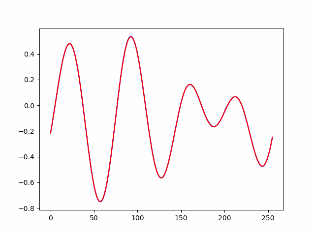
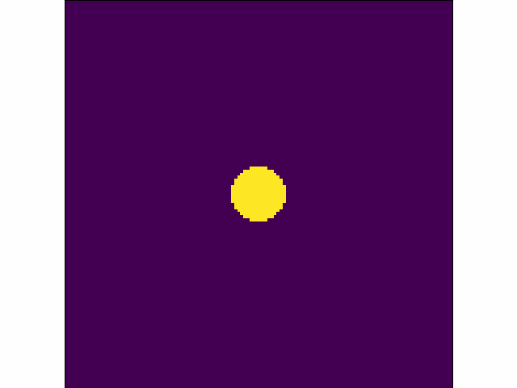

# LOD: Learnable Orthogonal Decomposition🔥


# Table of Contents📖
1. [Introduction📖](https://github.com/voltwin-dev/LOD-ML?tab=readme-ov-file#introduction)
2. [Datasets📚](https://github.com/voltwin-dev/LOD-ML?tab=readme-ov-file#datasets)
3. [POD preprocess🌊](https://github.com/voltwin-dev/LOD-ML?tab=readme-ov-file#pod-preprocess)
4. [LOD Training🤗](https://github.com/voltwin-dev/LOD-ML?tab=readme-ov-file#lod-training)
5. [Evaluation🌟](https://github.com/voltwin-dev/LOD-ML?tab=readme-ov-file#evaluation)
6. [LOD Inference🌊](https://github.com/voltwin-dev/LOD-ML?tab=readme-ov-file#lod-inference)
7. [Ablation Study🥛]()
8. [References](https://github.com/voltwin-dev/LOD-ML?tab=readme-ov-file#references)

# Introduction📖
|  | 
|:--:| 
| *Comparison of Auto-Regressive (FNO) and Non-Regressive (LOD) Methods on Advection Dataset.<br>Red: Ground truth, Green: FNO, Blue: LOD.* |
  
Understanding spatio-temporal data is a central challenge in the field of deep learning, particularly in solving Partial Differential Equations (PDEs). Existing approaches, such as Transformers and Neural Operators, have successfully mapped input conditions to PDE solutions but often face challenges due to their auto-regressive nature, which leads to increased computational costs and error accumulation over time. **In this paper, we introduce a novel approach called Learnable Orthogonal Decomposition (LOD)🤗, inspired by the classical Proper Orthogonal Decomposition (POD) technique and enhanced by deep learning.** LOD effectively decouples temporal and spatial information in PDE data, simplifying the learning process for neural networks. By focusing on the core architecture of LOD, the method is designed to maximize efficiency while maintaining high accuracy. Spatial bases are initialized with POD-generated components, which are set as learnable parameters within the model. **The deep learning model then predicts the temporal coefficients in a single inference step, enabling 🔥non-regressive prediction🔥 of the entire time series.** Experiments show that LOD not only accurately captures the dynamics of complex physical systems but also outperforms traditional POD methods, achieving high accuracy and low computational cost across various PDE benchmark datasets.
  
# Datasets📚
Before training, you must download the [PDEBench dataset](https://github.com/pdebench/PDEBench/tree/main/pdebench/data_download).  
You can download data through above link, also can utilize [this code](https://github.com/voltwin-dev/LOD-ML/blob/main/dataset/download_pdebench.ipynb).

Here, below is folder structure we recommend.
```
data2
├── PDEBench                  
│   ├── 1D
│       ├── Advection
│       ├── Burgers
│       ├── CFD
│       ├── ReactionDiffusion
│       ├── diffusion-sorption
│   ├── 2D           
│       ├── shallow-water
```
  
# POD preprocess🌊
```python
def POD(T, N_eigen):

    # Eigenvalue problem
    U = T @ T.T

    if (U==U.T).all(): # symmetric
      D, V = np.linalg.eigh(U)
    else:
      print('Not symmetric')
      D, V = np.linalg.eig(U)

    del U
    
    # Sorting eigenvalues and eigenvectors
    indices = D.argsort()[::-1]
    D = D[indices]
    V = V[:, indices]
    
    # Calculating cumulative energy ratio
    cumulative_energy_ratio = np.cumsum(D) / np.sum(D)
    #print(cumulative_energy_ratio >= 1 - epsilon)
    
    # Finding the number of eigenvalues to satisfy the energy threshold
    # n = np.argmax(cumulative_energy_ratio >= 1 - epsilon) + 1 # You can use threshold...
    n = N_eigen # hyperparameter
    
    # Normalizing eigenvectors
    EV = V[:, :n] / np.sqrt(D[:n])
    
    # Calculating the projection matrix
    phi = EV.T @ T
    
    # Reconstructing T
    Tr = T @ phi.T

    return Tr, phi, cumulative_energy_ratio # coeff, bases

```
This is the **core code** that performs the POD!  
With the above function, you can orthogonalize the time series data and generate **coefficients and bases** that have the shape of `N_eigen`.
  
## 1D-PDE
Use the [make_1D_POD](https://github.com/voltwin-dev/LOD-ML/blob/main/config/make_1D_POD.yaml) yaml files.
```yaml
dataset:
    root_path: '/data2/PDEBench/1D'
    save_path: '/data2/PDEBench/POD/' # We recommend
    data_path: ['1D_diff-sorp_NA_NA.h5'] # change data
    N_eigen: 64 # change hyperparameter
```
  
Then, implement below clode.
```python
python POD_1D_process.py
```
  
If you want to preprocess about CFD,
```python
python POD_1D_CFD_process.py
```
  
## Shallow-water
```python
python POD_2D_process.py
```
  
# LOD Training🤗
You can see the [training config](https://github.com/voltwin-dev/LOD-ML/tree/main/config) files.  
We provided `Advection`, `Burgers`, `Diffusion-Reaction`, `Diffusion-Sorption`, `CFD`, and `Shallow-Water`.
  
## 1D-PDE
- Advection, Burgers, Diffusion-Reaction, and Diffusion-Sorption
```python
python LOD_1D.py --pde [choose ...advection, burgers, reaction, sorption...]
```
  
- 1D-CFD
```python
python LOD_CFD.py
```  
  
## Shallow-water
```python
python LOD_2D.py
```
  
# Evaluation🌟
## Efficiency

  
| Model | Inference_Time | VRAM | # of parameters |
| --- | --- | --- | --- | 
| **FNO** | 43s | 34.83MB | 43137 | 
| **LOD-small** | **3s** | 34.83MB | 43325 |
| **LOD** | **7s** | 51.96MB | 4451194 |
  
In 1D-PDE dataset, LOD-small is about **14.3x** faster than FNO.  
LOD have a higher VRAM usage than FNO, but about **6.1x** faster inference speed.
  
## Performance (Advection)
| Model | `Advection beta 0.1` | `Advection beta 0.4` | `Advection beta 1.0` | `Advection beta 4.0` |
| --- | --- | --- | --- | --- | 
| `POD(Train)` | `0.001737` | `0.001668` | `0.001874` | `0.002480` |
| **FNO** | 0.009380 | 0.01261 | 0.009883 | 0.005690 |
| **PINN** | 0.7800 | 0.9200 | 0.4000 | 0.6600 |
| **TranSolver** | 0.003981 | 0.09200 | 0.2333 | 0.01509 | 
| **OFormer** | 0.004631 | 0.005718 | 0.007607 | 0.01281 | 
| **LOD-small** | 0.004515 | 0.01425 | 0.01027 | 0.07331 |
| **LOD** | **0.003422** | **0.004887** | **0.003890** | **0.005382** |
  
# LOD Inference🌊
## Code
```python
python 1D_visualization.py --pde [choose ...advection, burgers, reaction, sorption...]
python 2D_visualization.py
```
  
We provided some [checkpoints](https://drive.google.com/drive/folders/1yDLMFUdq16HwNyIJfMvCFoxqdmnKfyQ1?usp=sharing).  
You will easily implement our code..!  
```
checkpoint
├── lod_Advection_beta0.1.pt
├── lod_Burgers_Nu1.0.pt
├── lod_ReactionDiffusion_Nu0.5_Rho1.0.pt
├── lod_ReactionDiffusion_Nu5.0_Rho10.0.pt
└── lod-small_shallow-water_NA.pt
```
  
## Results
<table class="center">
<tr>
  <td style="text-align:center;" colspan="3"><b>LOD results</b></td>
</tr>
<tr>
  <td></td>
  <td></td>
  <td></td>              
</tr>
<tr>
  <td width=25% style="text-align:center;">"Advection case1 - LOD”</td>
  <td width=25% style="text-align:center;">"Advection case2 - LOD"</td>
  <td width=25% style="text-align:center;">"Advection case3 - LOD"</td>
</tr>

<tr>
  <td></td>
  <td></td>
  <td></td>              
</tr>
<tr>
  <td width=25% style="text-align:center;">"Burgers case1 - LOD”</td>
  <td width=25% style="text-align:center;">"Burgers case2 - LOD"</td>
  <td width=25% style="text-align:center;">"Burgers case3 - LOD"</td>
</tr>

<tr>
  <td></td>
  <td></td>
  <td></td>       
</tr>
<tr>
  <td width=25% style="text-align:center;">"Burgers case4 - LOD”</td>
  <td width=25% style="text-align:center;">"Diffusion-Reaction case1 - LOD"</td>
  <td width=25% style="text-align:center;">"Diffusion-Reaction case2 - LOD"</td>
</tr>
</table>
  
- Red: Ground Truth
- Blue: Prediction
  
<table class="center">
<tr>
  <td style="text-align:center;" colspan="4"><b>LOD-small results</b></td>
</tr>
<tr>
  <td></td>
  <td></td>
  <td></td>
  <td></td>     
</tr>
<tr>
  <td width=25% style="text-align:center;">"Shallow-Water case1 - GT”</td>
  <td width=25% style="text-align:center;">"Shallow-Water case1 - LOD-small"</td>
  <td width=25% style="text-align:center;">"Shallow-Water case2 - GT"</td>
  <td width=25% style="text-align:center;">"Shallow-Water case2 - LOD-small"</td>
</tr>

</table>

# Ablation Study🥛
## Comparison of Non-Regressive and Regressive Approaches🦎
This study suggests that **non-regressive methods like LOD may be more suitable** for applications where long-term predictive accuracy and stability are crucial.
<table class="center">
<tr>
  <td style="text-align:center;" colspan="2"><b>Comparison of RMSE at each time step [10, 40]</b></td>
</tr>
<tr>
  <td></td>
  <td></td>           
</tr>
<tr>
  <td width=25% style="text-align:center;">"Advection beta 0.1 - FNO”</td>
  <td width=25% style="text-align:center;">"Advection beta 0.1 - LOD"</td>
</tr>

<tr>
  <td></td>
  <td></td>           
</tr>
<tr>
  <td width=25% style="text-align:center;">"Advection beta 2.0 - FNO”</td>
  <td width=25% style="text-align:center;">"Advection beta 2.0 - LOD"</td>
</tr>

<tr>
  <td></td>
  <td></td>           
</tr>
<tr>
  <td width=25% style="text-align:center;">"Burgers nu 1.0 - FNO”</td>
  <td width=25% style="text-align:center;">"Burgers nu 1.0 - LOD"</td>
</tr>
</table>

You can make this plot through [visualization code](https://github.com/voltwin-dev/LOD-ML/blob/main/1D_visualization.py#L292).

## Effect of Eigenvalue Number on Performance🐍

## Scalability to Parameter-Integrated Scenarios🐲

## The Effect of Training Data Size on Test Accuracy🐉

# References
- [PDEBench](https://github.com/pdebench/PDEBench)
- [VCNeF](https://github.com/jhagnberger/vcnef)
