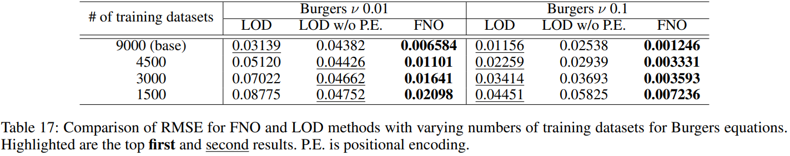
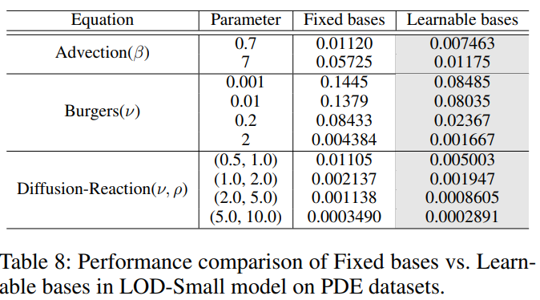

# Ablation Studies🥛
## Comparison of Non-Regressive and Regressive Approaches🦎
This study suggests that **non-regressive methods like LOD may be more suitable** for applications where long-term predictive accuracy and stability are crucial.
<table class="center">
<tr>
  <td style="text-align:center;" colspan="2"><b>Comparison of RMSE at each time step [10, 40]</b></td>
</tr>
<tr>
  <td></td>
  <td></td>           
</tr>
<tr>
  <td width=25% style="text-align:center;">"Advection beta 0.1 - FNO”</td>
  <td width=25% style="text-align:center;">"Advection beta 0.1 - LOD"</td>
</tr>

<tr>
  <td></td>
  <td></td>           
</tr>
<tr>
  <td width=25% style="text-align:center;">"Burgers nu 1.0 - FNO”</td>
  <td width=25% style="text-align:center;">"Burgers nu 1.0 - LOD"</td>
</tr>
</table>

You can make this plot through [visualization code](https://github.com/voltwin-dev/LOD-ML/blob/main/1D_visualization.py#L292).

## Effect of Eigenvalue Number on Performance🐍
You need to implement the [POD processing code]().  
In preprocess, you can modify `yaml` [config]().  
```yaml
dataset:
    root_path: '/data2/PDEBench/1D'
    save_path: '/data2/PDEBench/POD/'
    data_path: ['1D_Advection_Sols_beta4.0.hdf5']
    N_eigen: 128 # change
    data_num: 10000 # fixed
```

Then, 3 files will be generated.  
- 1D_Advection_Sols_beta4.0_10000_pde.npy
- 1D_Advection_Sols_beta4.0_10000_coeff128.npy
- 1D_Advection_Sols_beta4.0_10000_bases128.npy
  
Finally, you can use `LOD_eigenvalues.py` for ablation study.  
  
## The Effect of Training Data Size on Test Accuracy🐲

> LOD model is relatively robust to variations in the number of training samples. Additionally, although there is a slight performance decrease without positional encoding, the LOD becomes more robust.
  
Similar to above study, you can modify `yaml` [config]().  
```yaml
dataset:
    root_path: '/data2/PDEBench/1D'
    save_path: '/data2/PDEBench/POD/'
    data_path: ['1D_Burgers_Sols_Nu0.1.hdf5']
    N_eigen: 64 # fixed
    data_num: 5500 # train(N) + test(1000)
```

Then, 3 files will be generated.  
- 1D_Burgers_Sols_Nu0.1_5500_pde.npy
- 1D_Burgers_Sols_Nu0.1_5500_coeff64.npy
- 1D_Burgers_Sols_Nu0.1_5500_bases64.npy
  
Finally, you can use `LOD_datasize.py` for ablation study.

## Scalability to Parameter-Integrated Scenarios🐉

## Effect of Learnable Bases🦕
<p align="center"></p>

> This improvement was consistent across Advection, Burgers, and Diffusion-Reaction equations, with some cases showing error reductions of over 70%.
  
Similar to LOD training, you can modify `yaml` [config]().  
```yaml
# learnable bases
model: lod-small # lod-small // lod-small-learnable

# If you want to train diffusion-reaction, you need to use reaction setup.
dataset:
    name: Advection
    file_names: ["1D_Advection_Sols_beta0.7.hdf5"]
    t_train: 41
    x_range: 256
    initial_step: 10
    reduced_resolution: 4
    reduced_resolution_t: 5
    reduced_batch: 1
    num_channels: 1
```
  
If you select `lod-small-learnable`, the LOD-small predicts PDE using learnable bases.
```python
class LOD_small_learnable(nn.Module):
    def __init__(self, init_t, N_eigen, N_time, N_x, bases):
        super(LOD_small_learnable, self).__init__()

        self.N_eig = N_eigen
        self.hidden = N_x

        self.time_projection = nn.Sequential(
                                            nn.Linear(init_t, N_time), # no //2
                                            nn.GELU(),
                                            nn.Linear(N_time, N_time)
                                        )   

        self.latent_out = nn.Sequential(
                                    nn.Linear(self.hidden, self.hidden//2),
                                    nn.GELU(),
                                    nn.Linear(self.hidden//2, N_eigen),
                                )
        
        self.latent_bases = nn.Parameter(bases) # Add this,
```

Finally, you can use `LOD_bases.py` for ablation study.
