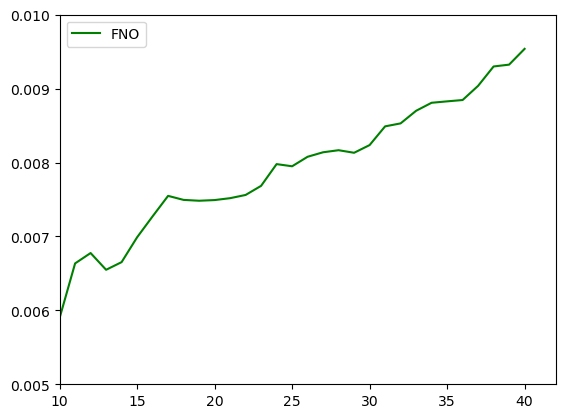
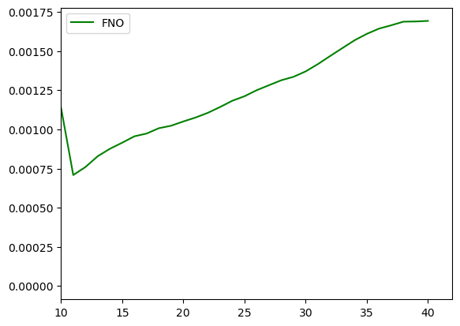
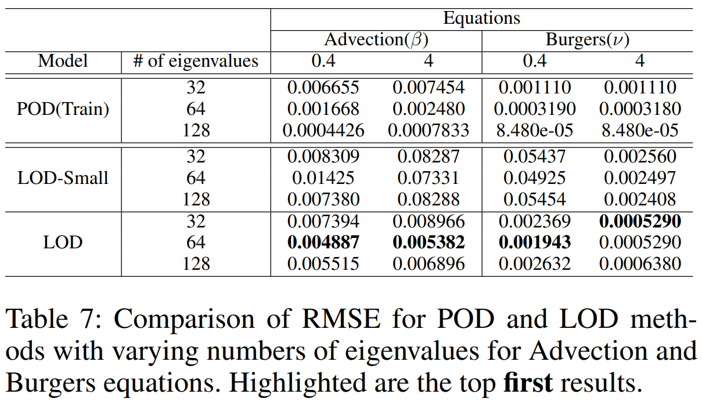

# Ablation Studies🥛
## Comparison of Non-Regressive and Regressive Approaches🦎
This study suggests that **non-regressive methods like LOD may be more suitable** for applications where long-term predictive accuracy and stability are crucial.
<table class="center">
<tr>
  <td style="text-align:center;" colspan="2"><b>Comparison of RMSE at each time step [10, 40]</b></td>
</tr>
<tr>
  <td></td>
  <td></td>           
</tr>
<tr>
  <td width=25% style="text-align:center;">"Advection beta 0.1 - FNO”</td>
  <td width=25% style="text-align:center;">"Advection beta 0.1 - LOD"</td>
</tr>

<tr>
  <td></td>
  <td></td>           
</tr>
<tr>
  <td width=25% style="text-align:center;">"Burgers nu 1.0 - FNO”</td>
  <td width=25% style="text-align:center;">"Burgers nu 1.0 - LOD"</td>
</tr>
</table>

You can make this plot through [visualization code](https://github.com/voltwin-dev/LOD-ML/blob/main/1D_visualization.py#L292).

## Effect of Eigenvalue Number on Performance🐍

> It indicates that LOD methods can potentially achieve competitive results with a well-chosen,moderate number of eigenvalues, offering a good trade-off between accuracy and computational efficiency.
  
You need to implement the [POD processing code]().  
In preprocess, you can modify `yaml` config.  
```yaml
dataset:
    root_path: '/data2/PDEBench/1D'
    save_path: '/data2/PDEBench/POD/'
    data_path: ['1D_Advection_Sols_beta4.0.hdf5']
    N_eigen: 128 # change
    data_num: 10000 # fixed
```

Then, 3 files will be generated.  
- 1D_Advection_Sols_beta4.0_10000_pde.npy
- 1D_Advection_Sols_beta4.0_10000_coeff128.npy
- 1D_Advection_Sols_beta4.0_10000_bases128.npy
  
Finally, you can use `LOD_eigenvalues.py` for ablation study.  
  
## The Effect of Training Data Size on Test Accuracy🐲

> LOD model is relatively robust to variations in the number of training samples. Additionally, although there is a slight performance decrease without positional encoding, the LOD becomes more robust.
  
Similar to above study, you can modify `yaml` config.  
```yaml
dataset:
    root_path: '/data2/PDEBench/1D'
    save_path: '/data2/PDEBench/POD/'
    data_path: ['1D_Burgers_Sols_Nu0.1.hdf5']
    N_eigen: 64 # fixed
    data_num: 5500 # train(N) + test(1000)
```

Then, 3 files will be generated.  
- 1D_Burgers_Sols_Nu0.1_5500_pde.npy
- 1D_Burgers_Sols_Nu0.1_5500_coeff64.npy
- 1D_Burgers_Sols_Nu0.1_5500_bases64.npy
  
Finally, you can use `LOD_datasize.py` for ablation study.

## Scalability to Parameter-Integrated Scenarios🐉
